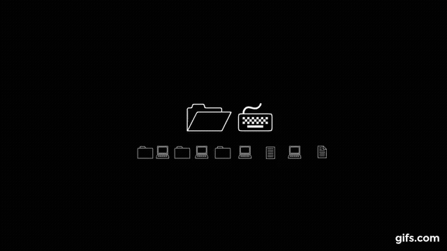
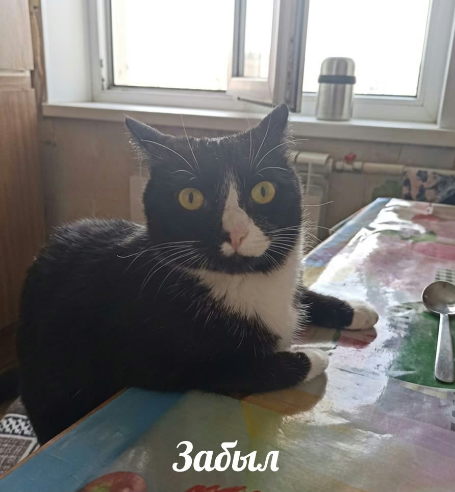
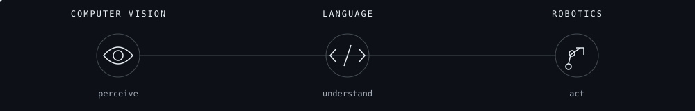

  

<h1 align="center">Hey, I'm Aruzhan.</h1>

<samp>AI STUDENT &nbsp; / &nbsp; PYTHON DEVELOPER &nbsp; / &nbsp; MEVINSS</samp>

<i>Curious about how machines see, understand and move.</i>

  
  
  

## A little about me

I'm studying **Artificial Intelligence at L.N. Gumilyov Eurasian National University** in Astana, Kazakhstan.

I'm drawn to the parts of AI that connect code with the world: **computer vision**, **robotics**, and **natural language processing**. I want to understand how a system can recognize a gesture, make sense of speech, or use perception to decide what to do next.

My projects range from **real-time gesture recognition** and **Kazakh speech transcription** to **ML scoring** and **forecasting**. I enjoy connecting models to Python APIs and building applications people can actually interact with.

**Currently exploring:** visual perception, language and speech models, and the foundations of intelligent robotic systems.

 

## Tools I work with

  

  

<samp>ALSO IN MY TOOLKIT</samp> 
pandas · NumPy · SQL · Jupyter · MediaPipe · Whisper · XGBoost

## Things I've been building

### Vision & language

**[Kazakh ASR — speech into text](https://github.com/Mevinss/Kazakh-Audio-Translator)**  
An audio/video transcription application comparing Whisper Base, Medium and Faster-Whisper Large-v3. Reference-based WER/CER evaluation, transcription history and SRT subtitle export.  
Python · Whisper · Flask · SQLite · FFmpeg

**Gesture-controlled interaction**  
Real-time hand gesture recognition for digital input, with MediaPipe landmarks and OpenCV frame processing.  
Python · MediaPipe · OpenCV

**[Deepfake detection & compression](https://github.com/Mevinss/Deepfake-Detection-Compression-Study)**  
A project exploring lightweight computer vision models and how video compression affects deepfake detection.  
PyTorch · OpenCV · MobileNetV3 · EfficientNet · GhostNet

### Applied machine learning

**[Van Gogh — subsidy application scoring](https://github.com/albina0dali/Van_Gogh)**  
Team hackathon project with model training, scoring, shortlists, explanations of scoring factors and regional reports.  
Python · scikit-learn · XGBoost · Flask

**[Jibek Joly — railway dispatch assistant](https://github.com/albina0dali/Jibek_Joly)**  
Team prototype for simulating incidents, comparing dispatch plans and previewing decisions on synthetic railway data.  
Python · FastAPI · OR-Tools · SQLite

**[WindPilot — wind power forecasting](https://github.com/Mevinss/windpilot-demo)**  
Team project forecasting hourly wind power 24–48 hours ahead, with weather features, historical model evaluation and a Python API.  
Python · pandas · scikit-learn · FastAPI

## Built with a team. Recognized at hackathons.

| CyberShield 2026 | KTZ ALT 2026 |
| :--- | :--- |
| **2nd place** · Van Gogh | **4th place** · Jibek Joly |
| ML scoring for subsidy applications | Railway dispatch decision support |

## GitHub activity

  
  

Live cards reflect public GitHub activity and may update with a delay.

---

  <b>Let's build something worth figuring out.</b>  
  Open to junior opportunities, internships and collaborations in AI / ML and Python development. 
  Astana, Kazakhstan · Kazakh / Russian / English

